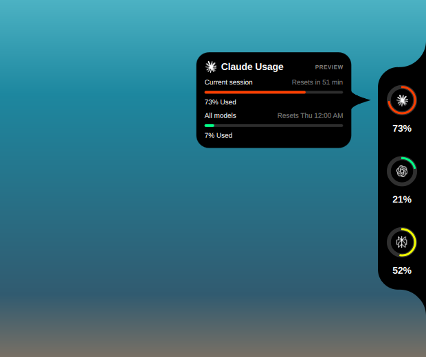

# Omarchy AI Usage

A native, edge-attached AI quota surface for Omarchy, inspired by the compact interaction model and visual language of CodeNotch.

> Release status: version 0.8.1 is ready for daily use and Omarchy Marketplace updates.



## What it does

Omarchy already includes an Agents bar widget. This project explores a different form: a small surface attached directly to a screen edge that expands into provider details without occupying the bar.

Live mode supports Claude Code and Codex using their existing signed-in sessions. Perplexity remains available only in the explicitly labeled visual preview and is never presented as live data.

## Highlights

- faithful black CodeNotch silhouette, provider rings, pointer-connected card, palette, and motion vocabulary;
- top, right, bottom, and left placement with a normalized continuous offset;
- focused, named, and all-display scopes with reconnect fallback;
- small, medium, and large semantic sizes;
- hover, click, and always-open rail behavior;
- optional provider label, percentage, reset timer, and motion;
- native in-card preferences persisted in Omarchy's own `shell.json` plugin entry;
- immediate updates when `omarchy.agents` replaces a provider record, plus one fallback poller per enabled provider;
- bounded retries with exponential backoff, auth-aware delay, and reset-aware rate-limit delay;
- explicit active, loading, stale, authentication, rate-limited, error, and unavailable states;
- click-on-ring manual refresh with concurrent requests collapsed into one follow-up;
- read-only normalization of Claude and Codex records maintained by `omarchy.agents`;
- one official usage source shared with compatible consumers such as OmaPkDex;
- no raw provider output, account identity, or credentials in logs or screenshots;
- local validation, portable contract tests, QML linting, and CI.

## Requirements

- Omarchy 4.0 or newer with the Quickshell-based shell;
- the built-in `omarchy.agents` widget enabled, because it owns usage collection;
- Claude Code and/or Codex, already signed in for live usage;
- Python 3.11 or newer;
- `omarchy plugin validate` for platform validation.

No third-party Python or JavaScript runtime dependency is required.

## Install

Install the plugin from this repository and enable it:

```sh
omarchy plugin add https://github.com/Bappoz/omarchy-ai-usage.git --enable
```

The notch appears at the right edge of the focused display by default. Hover
over it to reveal the provider rail, then select a provider to open its card.

If the plugin was installed previously but is disabled, enable it again:

```sh
omarchy plugin enable ai-usage.notch
```

## Configure it

Hover over the notch, open a provider, and select the sliders icon in the card. Each row cycles through its supported values. Changes are applied live and written through Omarchy's scoped plugin API.

Claude and Codex are enabled automatically. Toggle either one directly in the card—no code, API key, or manual JSON edit is required. At least one provider stays enabled.

| Setting | Available choices | Default | What it changes |
| --- | --- | --- | --- |
| Edge | Top, right, bottom, left | Right | Which screen edge owns the notch |
| Position | Start, center, end | Center | Where it sits along that edge |
| Display | Focused, all, a named connector | Focused | Which display or displays show it |
| Size | Small, medium, large | Medium | Notch, card, type, and ring scale |
| Open behavior | Hover, click | Hover | How the rail and card open |
| Auto-hide | On, off | On | Whether an idle rail collapses to the edge pill |
| Refresh interval | 5, 15, 30, 60 minutes | 15 minutes | Normal polling interval for enabled providers |
| Claude / Codex | On, off | On | Which live providers appear |
| Provider label / percentage / reset time | On, off | Label off; others on | Compact-surface information density |
| Motion | On, off | On | Surface transitions; turn off for a static UI |

The card is the recommended configuration path. For an exact display connector
or a continuous position, use the plugin entry in
`~/.config/omarchy/shell.json` after installing the plugin:

```json
{
  "id": "ai-usage.notch",
  "edge": "left",
  "offset": 0.25,
  "monitor": "DP-1",
  "size": "small",
  "autoHide": true,
  "expandBehavior": "click",
  "pollingInterval": 300,
  "showProviderLabel": true,
  "showPercentage": true,
  "showResetTimer": true,
  "animations": false,
  "enabledProviders": { "claude": true, "codex": false }
}
```

Use `monitor: "focused"` for the current display or `monitor: "all"` for
every display. `offset` accepts any value from `0.0` (start of the edge) to
`1.0` (end of the edge); `pollingInterval` accepts 60–3600 seconds. The full
configuration reference, including safe defaults and test-only overrides, is
in [Configuration](docs/configuration.md).

### Claude does not appear

1. Confirm the built-in **Agents** widget (`omarchy.agents`) is enabled in the bar.
2. Confirm Claude Code is installed with `claude --version`.
3. Sign in through Claude Code with `claude auth login` only when Claude itself reports that authentication is required.
4. Open the card settings and make sure **Claude** is **On**.
5. Restart the Omarchy shell after updating from a release older than 0.8.1.

The plugin does not start Claude Code, Codex, or `omarchy-agent-usage-update`. The built-in `omarchy.agents` widget is the single writer of `~/.local/state/omarchy/agents/usage/*.json`; the notch and OmaPkDex only watch and read those records. This avoids duplicate collection and keeps every surface on the same values.

Authentication remains owned by the provider clients and collection remains owned by Omarchy. The notch never reads credential files, tokens, browser storage, or raw provider responses.

The environment variables `OMARCHY_AI_USAGE_EDGE`, `OMARCHY_AI_USAGE_OFFSET`, and `OMARCHY_AI_USAGE_SCREEN` remain temporary, non-persistent overrides for visual testing. `OMARCHY_AI_USAGE_PREVIEW=1` enables the labeled synthetic reference composition. `OMARCHY_REDUCED_MOTION=1` disables surface animation for the session.

## Update safely

Updates preserve your configured preferences. Run:

```sh
omarchy plugin update ai-usage.notch
```

Then hover over the notch and open the Claude or Codex card once to request an
immediate refresh. The normal interval resumes afterwards. Verify the installed
plugin is enabled with:

```sh
omarchy plugin list
```

After an update, restart the shell so nested QML components are reloaded while
your stored settings remain in place:

```sh
omarchy restart shell
```

Do not use `omarchy refresh shell` for normal plugin updates: it resets shell
configuration rather than updating this plugin.

## Validation

Run the complete local gate:

```sh
make check
```

The gate runs unit and contract tests, Python linting, QML linting, and the official Omarchy plugin validator. CI runs the portable subset on every push and pull request.

To probe only the normalized shared provider output:

```sh
python helpers/omarchy_agent_provider.py --provider claude
python helpers/omarchy_agent_provider.py --provider codex
```

Provider problems are represented as safe status objects and still exit successfully. Invalid command-line arguments exit with code 2.

## Remove

Remove the plugin with Omarchy's normal lifecycle command:

```sh
omarchy plugin remove ai-usage.notch
```

Marketplace maintainers validate the current public commit before approval. The repository includes a root `preview.png`, license, safe lifecycle instructions, and the official validator gate. See [Marketplace publishing](docs/marketplace-publishing.md).

See [Release readiness](docs/release-readiness.md) for the checks to complete before tagging a public release.

## Repository layout

```text
.
├── manifest.json
├── contracts/provider-snapshot.schema.json
├── helpers/omarchy_agent_provider.py
├── src/
│   ├── model/
│   ├── ui/
│   └── Main.qml
├── tests/
└── docs/
```

## Privacy and security

The repository contains no real provider output or account data. Authentication stays inside Claude Code and Codex. Omarchy writes normalized quota records, and this plugin reads only those records; it never opens credential files or launches a provider client. Snapshots contain usage windows, percentages, reset times, and an optional plan label—never tokens or account identifiers. See [Security policy](SECURITY.md).

## License and attribution

MIT. CodeNotch-derived visual geometry and bundled provider marks retain their respective attribution in [THIRD_PARTY_NOTICES.md](THIRD_PARTY_NOTICES.md).
